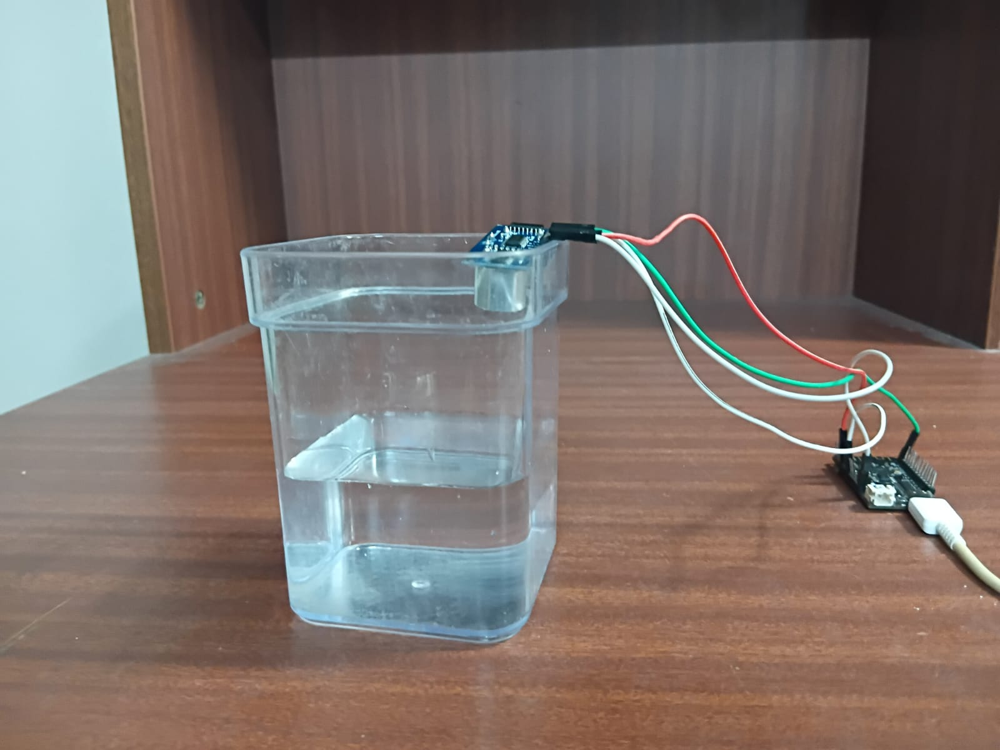
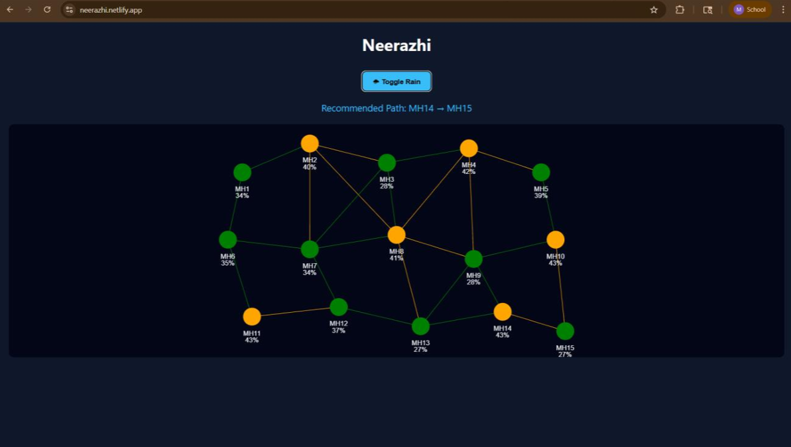

# 🌊 Smart Manhole-Based Flood Monitoring & Decision Support System

An IoT-based system for **real-time urban drainage monitoring**, designed to detect manhole water levels, classify flood risk, and provide intelligent decision support using a cloud-based dashboard.

---

## 📌 Overview

Urban flooding is a major challenge due to poor drainage monitoring and delayed response. This project implements a **smart manhole monitoring system** using ESP32 microcontrollers and ultrasonic sensors to:

* Measure real-time water levels inside manholes
* Send data to a cloud server (website)
* Classify conditions (Normal / Warning / Overflow)
* Provide decision support for safer drainage routing

---

## ⚙️ System Architecture


```
Ultrasonic Sensor → ESP32 Node → WiFi (HTTP) → Cloud Server → Dashboard + Decision System
```

* Each ESP32 acts as an independent **sensor node**
* The **website replaces the central controller**
* Data is processed and visualized in real time

---

## 🧠 Features

* 📡 Real-time water level monitoring
* 🌐 Direct ESP-to-cloud communication (no central ESP required)
* 🚦 Status classification:

  * 🟢 Normal (< 40%)
  * 🟠 Warning (40–75%)
  * 🔴 Overflow (> 75%)
* 🔔 Alert generation for critical conditions
* 🧭 Decision support system for drainage routing
* 📊 Scalable dashboard for multiple manholes

---

## 🛠️ Hardware Requirements

* ESP32 (2 or more nodes)
* Ultrasonic Sensor (HC-SR04)
* Jumper wires
* Breadboard / PCB
* Power supply

---

## 💻 Software Requirements

* Arduino IDE / PlatformIO
* ESP32 Board Package
* WiFi + HTTPClient libraries

---

## 🔌 Working Principle

1. Ultrasonic sensor measures distance to water surface
2. ESP32 converts distance → water level percentage
3. Data is sent to the server via HTTP POST
4. Server processes and stores data
5. Dashboard updates in real time
6. Decision logic suggests safe drainage paths

---

## 📡 API Format

### Request (ESP → Server)

```json
{
  "node_id": 1,
  "level": 78
}
```

---

## 🧮 Water Level Calculation

```
level (%) = ((MAX_HEIGHT - distance) / MAX_HEIGHT) × 100
```

Values are clamped between 0% and 100% for accuracy.

---

## 🚨 Decision Logic

```js
if (node1 > 75 && node2 > 75)
    return "No Safe Path Available";
else if (node1 < node2)
    return "Route water to Node 1";
else
    return "Route water to Node 2";
```

---

## 📊 Dashboard Features

* Live manhole status visualization
* Color-coded nodes (Green / Orange / Red)
* Dynamic updates every few seconds
* Network-based drainage representation
* Intelligent path recommendation

---

## 🚀 Future Enhancements

* 📱 Mobile app integration
* 🤖 AI/ML-based flood prediction
* 🌦️ Weather data integration
* 📡 LoRa for long-range communication
* 🔋 Low-power optimization

---

## 📚 Use Cases

* Smart city drainage systems
* Urban flood monitoring
* Disaster management
* Municipal infrastructure tracking

---

## 👩‍💻 Authors

* Mridula B
* Shreya Ranjitha M
* Prithivisree S
* Somesh T G

---

